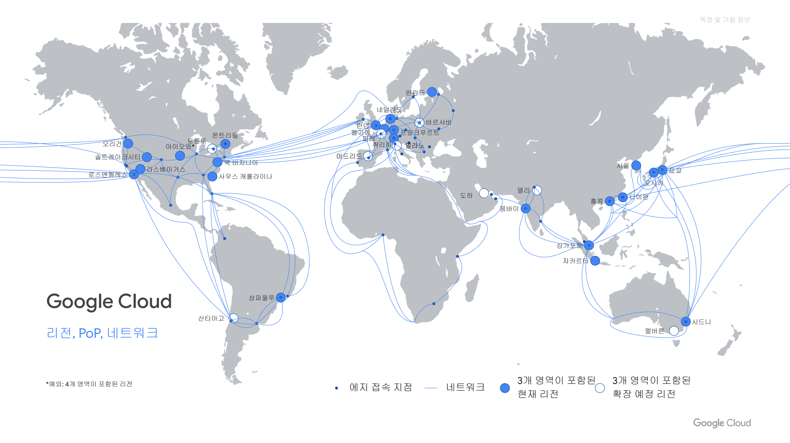

<!-- Page 1 -->
<!-- _class: lead -->

  
  Google Cloud

# 구글 클라우드 교육

### 제 0 장: 클라우드 컴퓨팅 기초 및 Google Cloud 소개

  Architecting with Google Compute Engine (2026 개정판)

  교육 자료 | 2026

<!--
comment: 
💬 [강사 대본]
"안녕하세요 수강생 여러분! Architecting with Google Compute Engine 과정에 오신 것을 진심으로 환영합니다. 저는 이번 3일간 여러분과 함께 구글 클라우드 인프라 아키텍팅을 공부할 강사입니다. 본 과정은 Compute Engine을 중심으로 네트워크, 보안, 모니터링, Terraform 자동화 배포까지 실무 중심으로 습득하는 정규 과정입니다."
-->

---

<!-- Page 2 -->

## 01. 강사 소개

  

    
2019 ~ 현재

    
베스핀글로벌 구글 MSP 팀 / Cloud 엔지니어

  

  

    
2018 ~ 2019

    
신한 DS / 인프라 운영

  

  

    
2015 ~ 2018

    
쌍용정보통신 / 네트워크 엔지니어

  

  

    
2015 년

    
연세 IT 전문학원

  

  

    
2012 년

    
충북대학교 고고미술사학과 (졸업)

  

<!--
comment:
💬 [강사 대본]
"본격적인 수업에 앞서 제 소개를 간단히 드리겠습니다. 저는 네트워크 엔지니어를 시작으로 금융권 인프라 운영을 거쳐, 2019년부터 지금까지 베스핀글로벌 구글 MSP 팀에서 Google Cloud 엔지니어 및 아키텍트로 재직하고 있습니다. 현업에서 수많은 기업의 Google Cloud 마이그레이션과 아키텍팅 솔루션을 직접 구축하며 얻은 실무 팁과 노하우를 공유해 드리겠습니다."
-->

---

<!-- Page 3 -->

## 에티켓 (Etiquette - Part 1)

  

    
📵

    
통화 금지

    
강의 진행 중 휴대폰 통화는 강의실 밖에서 진행해 주세요.

  

  

    
🚫

    
녹화 금지

    
저작권 보호를 위해 강의 내용의 캡처 및 화면 녹화를 금지합니다.

  

  

    
❓

    
질문하기

    
궁금한 사항은 손을 들거나 채팅창을 통해 언제든 질문해 주세요.

  

<!--
comment:
💬 [강사 대본]
"원활한 강의 환경을 위한 첫 번째 에티켓입니다. 급한 통화는 강의실 밖에서 진행해 주시기 바라며, 자료 저작권 보호를 위해 화면 캡처나 녹화를 금지하고 있습니다. 궁금한 점이 생기시면 언제든 편하게 질문해 주세요."
-->

---

<!-- Page 4 -->

## 에티켓 (Etiquette - Part 2)

  

    
🎙️

    
마이크 음소거

    
발표자 이외의 불필요한 배경 소음 방지를 위해 마이크를 음소거합니다.

  

  

    
🚫

    
녹화 금지

    
본 과정의 모든 실습 및 영상 자료의 무단 배포를 금지합니다.

  

  

    
💬

    
질문하기

    
실습 중 발생하는 오류나 막히는 부분은 즉시 강사에게 요청하세요.

  

<!--
comment:
💬 [강사 대본]
"온라인/원격 환경에서는 소음 방지를 위해 마이크를 음소거 상태로 유지해 주시기 바라며, 실습 중 막히거나 에러가 발생하면 주저하지 마시고 바로 저에게 질문해 주세요."
-->

---

<!-- Page 5 -->

## Google Cloud 생태계 (Global Ecosystem)

<ul>
  <li><strong>글로벌 인프라 서비스</strong>: Search, YouTube, Gmail, Workspace 지원 고성능 사설 망</li>
  <li><strong>오픈소스 소프트웨어 & 파트너</strong>: Kubernetes, Terraform, Redis, MongoDB 완벽 호환</li>
  <li><strong>고객 및 개발자 서비스</strong>: Chrome, Maps, Analytics, Vertex AI & Gemini AI 연계</li>
</ul>

<!--
comment:
💬 [강사 대본]
"Google Cloud는 수십억 명의 사용자를 매일 처리하는 YouTube, Gmail, Search와 동일한 전용 사설 광케이블 백본망 위에서 구동됩니다. 쿠버네티스나 테라폼 같은 오픈소스 생태계를 이끌며 최신 AI인 Gemini까지 완벽히 연결됩니다."
-->

---

<!-- Page 6 -->

## 글로벌 인프라 (Region, PoP, Network)

<ul>
  <li><strong>리전 (Region)</strong>: 전 세계 40개 이상 (서울 asia-northeast3 등)</li>
  <li><strong>영역 (Zone)</strong>: 리전당 최소 3개 이상의 독립 고가용성 존</li>
  <li><strong>에지 접속 지점 (PoP)</strong>: 지구를 둘러싼 Google 전용 고속 광케이블 네트워크</li>
</ul>

<!--
comment:
💬 [강사 대본]
"이 지도가 바로 Google Cloud의 글로벌 인프라 지도입니다. 서울 리전을 비롯해 40개 이상의 리전이 존재하며, 각 리전은 최소 3개의 독립된 존(Zone)으로 구성되어 완벽한 고가용성을 제공합니다."
-->

---

<!-- Page 7 -->

## Google Cloud는...

  <h2 style="color: #1a73e8; margin-bottom: 20px;">다양한 비즈니스 요구사항을 충족하는 클라우드</h2>
  
컴퓨팅, 데이터베이스, AI, 네트워킹에 이르기까지 기업의 상황에 맞는 최적의 클라우드 인프라 제품군을 다각도로 제공합니다.

<!--
comment:
💬 [강사 대본]
"Google Cloud는 기업마다 다른 비즈니스 상황과 요구사항을 맞춤형으로 충족할 수 있도록 정교한 제품군을 갖추고 있습니다. 자유롭게 조합할 수 있는 유연성이 가장 큰 장점입니다."
-->

---

<!-- Page 8 -->

## 일반적인 문제에 대한 솔루션 다양성

  <h3 style="color: #1a73e8; font-size: 28px; margin-top:0;">💡 하나의 과제에 대해 2개 이상의 솔루션 제공</h3>
  

    Google Cloud는 동일한 목적의 워크로드에 대해서도 <strong>가상 머신(IaaS), 컨테이너(CaaS), 서버리스(PaaS)</strong> 등 조직의 관리 역량과 비용 모델에 따라 선택할 수 있는 다중 솔루션을 제공합니다.
  

<!--
comment:
💬 [강사 대본]
"GCP 아키텍팅의 핵심 원칙은 '하나의 문제에 항상 2개 이상의 솔루션이 존재한다'는 점입니다. VM, 컨테이너, 서버리스 중 조직의 역량과 비용 모델에 맞는 최적의 기술을 선택하시면 됩니다."
-->

---

<!-- Page 9 -->

## 솔루션 연속성 (Solution Continuum)

| 구분 | IaaS (Compute Engine) | CaaS (GKE) | PaaS / Serverless (Cloud Run) |
| :--- | :--- | :--- | :--- |
| **제어 수준** | OS / Kernel 전체 제어 | Container 오케스트레이션 | 애플리케이션 코드 & 이미지 |
| **운영 모델** | SysOps (직접 OS 관리) | DevOps (클러스터 관리) | No-Ops (Google 완전 관리) |
| **적용 영역** | 커스텀 OS, 레거시 이전 | 마이크로서비스 (K8s) | Web API, 이벤트를 받는 웹 앱 |

<!--
comment:
💬 [강사 대본]
"IaaS(Compute Engine)는 OS 전체 제어가 가능하지만 직접 관리(SysOps) 부담이 큽니다. 반면 서버리스(Cloud Run)는 구글이 인프라를 완전 관리해주는 No-Ops 환경을 제공합니다."
-->

---

<!-- Page 10 -->

## 인프라, 사용자, 애플리케이션 구조

<ul>
  <li><strong>기반 인프라 (Underlying Infrastructure)</strong>: Google 글로벌 전용 사설망, Compute Engine VM, VPC</li>
  <li><strong>애플리케이션 계층 (Application Tier)</strong>: GKE Pod, Cloud Run 컨테이너, 서버리스 함수</li>
  <li><strong>사용자 및 디바이스 (Users & Endpoints)</strong>: IAM 인증, Identity-Aware Proxy, 보안 게이트웨이</li>
</ul>

<!--
comment:
💬 [강사 대본]
"도시 구조로 비유하면 도로와 전력망 같은 도시 인프라가 바로 구글의 '기반 인프라'입니다. 상점과 차량이 '애플리케이션'이며, 시민이 '사용자'입니다. 이번 과정은 가장 밑바탕이 되는 인프라를 배웁니다."
-->

---

<!-- Page 11 -->

## 컴퓨팅 서비스 01: Compute Engine

<ul>
  <li><strong>Google Cloud의 대표 IaaS (Virtual Machines)</strong></li>
  <li><strong>특징 및 장점</strong>: 커스텀 사양, Live Migration (무중단 이동), GPU/TPU, Spot VM 비용 절감</li>
</ul>

<!--
comment:
💬 [강사 대본]
"대표 IaaS인 Compute Engine입니다. 구글만의 Live Migration 기능 덕분에 물리 서버 점검 시에도 수강생분의 VM이 중단되지 않고 실시간 이동됩니다."
-->

---

<!-- Page 12 -->

## 컴퓨팅 서비스 02: Google Kubernetes Engine (GKE)

<ul>
  <li><strong>쿠버네티스 원조 Google의 관리형 CaaS</strong></li>
  <li><strong>특징 및 장점</strong>: GKE Standard 및 GKE Autopilot (완전 관리형 K8s Pod 운영)</li>
</ul>

<!--
comment:
💬 [강사 대본]
"관리형 쿠버네티스인 GKE입니다. 특히 GKE Autopilot 모드를 사용하면 노드 서버 관리 부담 없이 컨테이너 Pod 단위로만 깔끔하게 운영하실 수 있습니다."
-->

---

<!-- Page 13 -->

## 컴퓨팅 서비스 03: App Engine

<ul>
  <li><strong>Google Cloud의 전통적인 PaaS</strong></li>
  <li><strong>특징 및 장점</strong>: Standard & Flexible 환경, 서버 관리 없이 코드 즉시 배포</li>
</ul>

<!--
comment:
💬 [강사 대본]
"구글의 오리지널 PaaS인 App Engine입니다. 개발자가 소스 코드만 제출하면 구글이 알아서 인프라 구성과 트래픽 확장을 처리해 줍니다."
-->

---

<!-- Page 14 -->

## 컴퓨팅 서비스 04: Cloud Functions (Cloud Run Functions)

<ul>
  <li><strong>이벤트 기반 FaaS (Function-as-a-Service)</strong></li>
  <li><strong>특징 및 장점</strong>: Cloud Storage 파일 업로드 / Pub/Sub 수신 반응 실행 (트래픽 0일 때 0원)</li>
</ul>

<!--
comment:
💬 [강사 대본]
"이벤트 기반 서버리스 함수인 Cloud Functions입니다. 스토리지 파일 업로드 등 이벤트 발생 시에만 1초 간 작동하는 스크립트에 적합하며 트래픽 0일 땐 비용도 0원입니다."
-->

---

<!-- Page 15 -->

## 컴퓨팅 서비스 05: Cloud Run

<ul>
  <li><strong>모던 서버리스 컨테이너 플랫폼</strong></li>
  <li><strong>특징 및 장점</strong>: 표준 Docker 컨테이너 기반, 0개부터 수천 개까지 초단위 자동 스케일링</li>
</ul>

<!--
comment:
💬 [강사 대본]
"가장 추천하는 모던 서버리스인 Cloud Run입니다. Docker 이미지 하나만 넣어주면 0개부터 수천 개까지 초단위로 알아서 자동 스케일링됩니다."
-->

---

<!-- Page 16 -->

## 컴퓨팅 서비스 비교 매트릭스 (Compute Options)

| 서비스 | 제어 수준 | 스케일링 속도 | 주요 유즈케이스 |
| :--- | :--- | :--- | :--- |
| **Compute Engine** | OS 포함 전체 | 분 단위 | 커스텀 OS, DB 서버, 레거시 이전 |
| **GKE** | 컨테이너 / Pod | 초~분 단위 | 대규모 마이크로서비스 |
| **App Engine** | 앱 코드 / 런타임 | 초~분 단위 | 웹 애플리케이션 (PaaS 코드 즉시 배포) |
| **Cloud Run** | 컨테이너 이미지 | 초 단위 | 웹 앱, REST API, 백엔드 서비스 |
| **Cloud Functions** | 단일 코드 함수 | 초 단위 | 이벤트 반응형 자동화 스크립트 |

<!--
comment:
💬 [강사 대본]
"5가지 컴퓨팅 옵션 비교표입니다. OS 제어는 Compute Engine, K8s 마이크로서비스는 GKE, PaaS 웹앱은 App Engine, 서버리스 컨테이너는 Cloud Run을 선택하시면 됩니다."
-->

---

<!-- Page 17 -->

## 클라우드 인프라 학습 과정

  

    <h3 style="color: #1a73e8; margin-top: 0; font-size: 24px;">클라우드 인프라</h3>
    

      Google Cloud는 전 세계 수십억 명의 사람들이 사용하는 YouTube, Gmail 등의 Google 제품을 지원하는 인프라와 동일한 글로벌 인프라에서 실행됩니다.  인프라 및 애플리케이션 구현, 배포, 마이그레이션, 유지보수에 대한 Google Cloud의 접근 방식을 알아보세요.
    

  

  

    

      
1

      
Google Cloud Fundamentals: Core Infrastructure

    

    

      
2

      
Architecting with Google Compute Engine (본 교육 과정)

    

    

      
3

      
Architecting with Google Cloud: Design and Process

    

  

<!--
comment:
💬 [강사 대본]
"전체 공식 커리큘럼 로드맵입니다. 우리가 배우는 2단계 Compute Engine 과정이 인프라 아키텍팅의 가장 중심이 되는 대표 과정입니다."
-->

---

<!-- Page 18 -->

## 1일 차 주제: 기초 (Day 1 - Foundation)

  

    
01. Google Cloud 소개

    
GCP 콘솔, Cloud Shell, 프로젝트 계정 실습

  

  

    
02. 가상 네트워크

    
VPC 네트워킹, Private Access, Cloud NAT 실습

  

  

    
03. 가상 머신

    
Compute Engine VM 인스턴스 생성 및 SSH 실습

  

<!--
comment:
💬 [강사 대본]
"오늘 진행되는 1일 차 '기초' 커리큘럼입니다. 모듈 01 GCP 콘솔 및 Cloud Shell, 모듈 02 VPC 가상 네트워크, 모듈 03 Compute Engine VM 실습 순서로 진행됩니다."
-->

---

<!-- Page 19 -->

## 2일 차 주제: 핵심 서비스 (Day 2 - Core Services)

  

    
04. Identity and Access Management

    
IAM 사용자, 역할 및 서비스 계정 권한 실습

  

  

    
05. 데이터 스토리지 서비스

    
Cloud Storage 버킷 생성 및 Cloud SQL 구축 실습

  

  

    
06. 리소스 관리

    
BigQuery를 활용한 결제 데이터 분석 및 조직 관리 실습

  

  

    
07. 리소스 모니터링

    
Cloud Monitoring & Logging 시스템 모니터링 실습

  

<!--
comment:
💬 [강사 대본]
"내일 2일 차에는 IAM 권한 보안, Cloud Storage 및 Cloud SQL 데이터베이스, BigQuery 결제 분석, Cloud Monitoring 시스템 모니터링을 다룹니다."
-->

---

<!-- Page 20 -->

## 3일 차 주제: 확장 및 자동화 (Day 3 - Scaling & IaC)

  

    
08. 네트워크 상호 연결

    
Cloud VPN 구축 및 하이브리드 연결 실습

  

  

    
09. 부하 분산 및 자동 확장

    
HTTP Load Balancer & MIG Autoscaling 구축 실습

  

  

    
10. 인프라 자동화

    
Terraform을 활용한 코드 기반 인프라(IaC) 배포 실습

  

  

    
11. 관리형 서비스

    
모던 클라우드 관리형 서비스 및 아키텍처 패턴 설계

  

<!--
comment:
💬 [강사 대본]
"마지막 3일 차에는 하이브리드 Cloud VPN, 부하 분산과 자동 스케일링, 그리고 최근 필수인 Terraform 기반 인프라 코드(IaC) 자동 배포 실습을 진행합니다."
-->

---

<!-- Page 21 -->

## 실습 환경 안내 (GCP Lab Environment)

<ul>
  <li><strong>베스핀글로벌 제공 GCP 실습 환경</strong>: 조직 `bespin.email` / 프로젝트 `KDT5T`</li>
  <li><strong>실습 준비사항</strong>: 전용 GCP 프로젝트 내에서 실습 진행 (별도 Qwiklabs 계정 필요 없음)</li>
</ul>

<!--
comment:
💬 [강사 대본]
"실습 환경 안내입니다. 본 실습은 퀵랩이 아니라 저희 베스핀글로벌에서 수강생분들을 위해 구성한 bespin.email 조직의 KDT5T 전용 프로젝트에서 진행됩니다."
-->

---

<!-- Page 22 -->

## 실습 보안 필수 수칙 (Security & Key Management)

  
🚨 Service Account Key & API Key 엄격 관리

  

    • <strong>Service Account Key 및 API Key는 절대 Public망 또는 GitHub public 저장소에 업로드하지 마세요!</strong> 
    • 키 노출 시 봇(Bot)에 의한 <strong>해킹 탐지 및 과도한 서비스 금액 폭탄(비용 발생)</strong>이 유발됩니다.
  

<ul>
  <li><strong>보안 관리 수칙</strong>: `.gitignore` 파일 자격 증명 키(`*.json`, `.env`) 필수 등록</li>
</ul>

<!--
comment:
🚨 [보안 강조 강사 대본]
"가장 중요한 보안 수칙입니다! Service Account Key JSON 파일이나 API Key는 절대로 GitHub 등 공개 저장소에 올리시면 안 됩니다. 노출 시 봇에 의해 해킹당하고 수천만 원의 비용 폭탄이 청구됩니다. 반드시 .gitignore에 등록해 관리하세요!"
-->

---

<!-- Page 23 -->

## 실습 비용 및 리소스 관리 수칙 (FinOps Guide)

  
⚠️ 실습 종료 시 VM Off 및 비용 인지 수칙

  

    • <strong>수업 종료 및 실습 미진행 시에는 항상 가상 머신(VM)을 끄기(OFF)해야 합니다.</strong> 
    • GCP 결제 데이터는 <strong>최소 2일 후에나 확인 가능</strong>하므로, 실습 진행 시 항시 비용 발생 위험을 고려해야 합니다.
  

<ul>
  <li><strong>리소스 절감 체크리스트</strong>: 미사용 Compute Engine VM, External IP 즉시 정리</li>
</ul>

<!--
comment:
⚠️ [비용 관리 강사 대본]
"수업 종료 시나 쉬는 시간엔 반드시 켜둔 Compute Engine VM을 OFF로 끄셔야 합니다. GCP 결제 데이터는 최소 48시간(2일) 뒤에 집계되므로 '지금 비용 안 떴네' 하고 방치하시면 2일 뒤에 큰 금액이 찍힙니다."
-->

---

<!-- Page 24 -->

## 실습 환경 기본 유의사항 종합 (Lab Guidelines)

  

    
🔒 자격 증명 보안

    
Service Account / API Key 공유 금지 및 GitHub 퍼블릭 업로드 절대 엄금

  

  

    
🛑 리소스 전원 관리

    
실습 중단 및 일과 종료 시 VM 인스턴스 OFF 필수 이행

  

  

    
💰 결제 시차 인지

    
요금 집계는 최소 2일(48시간) 후 반영되므로 사전 비용 고려 필수

  

  

    
🏢 지정 프로젝트 사용

    
`bespin.email` 조직의 `KDT5T` 프로젝트 전용 실습 이행

  

<!--
comment:
💬 [강사 대본]
"앞서 말씀드린 보안, VM 전원 관리, 2일 요금 시차 인지, KDT5T 지정 프로젝트 사용 등 4가지 유의사항 종합 정리 카드입니다."
-->

---

<!-- Page 25 -->

## 수업 종료 후 수료 및 복습 안내

<ul>
  <li><strong>강의 자료 및 프로젝트 활용</strong>: 제공된 실습 가이드 및 `KDT5T` 프로젝트 내 결과물 복습</li>
  <li><strong>문의 및 지원</strong>: 교육 수료 후 기술 관련 문의는 담당 강사 및 MSP 팀 채널 활용</li>
</ul>

<!--
comment:
💬 [강사 대본]
"수업 수료 후에도 제공해 드린 교재와 프로젝트 자료로 복습하실 수 있으며, 문의 사항은 MSP 팀 기술 지원 채널로 질문해 주시면 친절히 가이드해 드리겠습니다."
-->

---

<!-- Page 26 -->

<!-- _class: lead -->

  
  Google Cloud

Q & A SESSION

# 감사합니다!

### 질문이나 궁금하신 점이 있으시면 편하게 말씀해 주세요.

  교육 자료 | 2026

<!--
comment:
💬 [강사 대본]
"이상으로 오리엔테이션 및 모듈 00 소개를 마치겠습니다. 궁금하신 점이 있으시면 편하게 질문해 주시고, 없으시면 10분 휴식 후 모듈 01 본격 수업으로 들어가겠습니다. 감사합니다!"
-->
