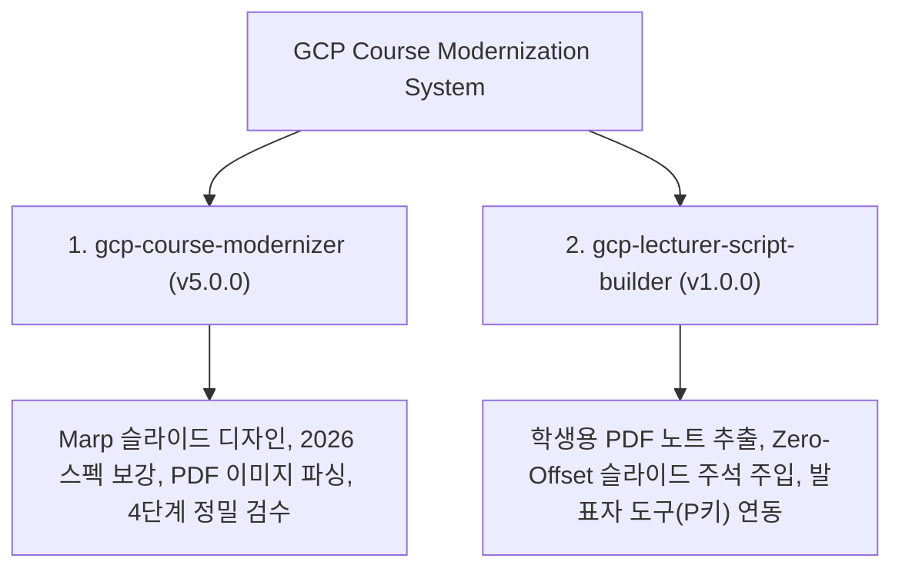
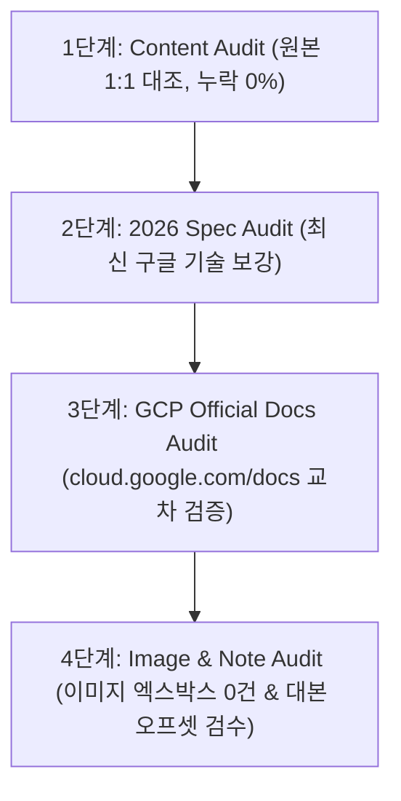

# 📘 GCP Course Modernization & Lecturer Script Handover Guide (v5.0.0)

본 문서는 **Google Cloud Authorized Trainer & Presentation Designer** 프로젝트의 전체 시스템 아키텍처, 2대 전용 스킬(Skills), 8대 절대 철칙, 4단계 정밀 검수 프로세스 및 후속 작업자를 위한 실무 인수인계 지침서입니다.

---

## 📑 목차 (Table of Contents)

1. [프로젝트 개요 & 저장소 정보](#1-프로젝트-개요--저장소-정보)
2. [2대 전용 스킬 (Dedicated Skills)](#2-2대-전용-스킬-dedicated-skills)
3. [8대 절대 철칙 (8 Unbreakable Directives)](#3-8대-절대-철칙-8-unbreakable-directives)
4. [4단계 정밀 검수 스킬 (4-Step Audit Standards)](#4-4단계-정밀-검수-스킬-4-step-audit-standards)
5. [강사 발표문(Presenter Notes) 1:1 주입 & 오프셋 예방 로직](#5-강사-발표문presenter-notes-11-주입--오프셋-예방-로직)
6. [파이썬 자동화 스크립트 파이프라인](#6-파이썬-자동화-스크립트-파이프라인)
7. [모듈별 진행 현황 & 향후 작업 매뉴얼](#7-모듈별-진행-현황--향후-작업-매뉴얼)
8. [CLI 컴파일 & GitHub 동기화 가이드](#8-cli-컴파일--github-동기화-가이드)

---

## 1. 프로젝트 개요 & 저장소 정보

- **프로젝트명**: Google Cloud Authorized Course Modernization (2026 Edition)
- **대상 교재**: *Architecting with Google Compute Engine v2.2 (한글 2025/2026)*
- **핵심 목표**:
  - 원본 PDF 교안(`학생용/*.pdf`) 1:1 완벽 페이지 매칭 및 2026 최신 구글 클라우드 스펙 반영.
  - Marp CLI 기반 16:9 Clean Light Theme 슬라이드 데크 구축.
  - 원본 강사 발표 대본(Presenter Notes) 1:1 주입 및 발표자 도구(**`P` 키**) 연동.
- **GitHub Private 저장소**: `https://github.com/lbj0412/architecting-gcp-compute-engine-2026.git`
- **작업 공간**: `c:\Users\C\Documents\Architecting with Google Compute Engine v2.2(한글 2025)`

---

## 2. 2대 전용 스킬 (Dedicated Skills)

시스템은 2가지 전문화된 전용 스킬로 구성되어 있습니다:



### ① `gcp-course-modernizer` (v5.0.0)
- **위치**: `C:\Users\C\.gemini\config\skills\gcp-course-modernizer\SKILL.md`
- **역할**: PDF 교안 1:1 완벽 매칭 수술, Marp 슬라이드 렌더링, 2026 최신 구글 클라우드 기술(C3/C4/N4, Hyperdisk, Balanced PD, Spot VM 91% 할인) 반영, 4단계 정밀 검수.

### ② `gcp-lecturer-script-builder` (v1.0.0)
- **위치**: `C:\Users\C\.gemini\config\skills\gcp-lecturer-script-builder\SKILL.md`
- **역할**: `학생용/*.pdf` 원본 교재 하단 구글 공인 강사/수강생 해설 대본 100% 파싱, Zero-Offset 마크다운 주석(`<!-- comment: ... -->`) 주입, 발표자 도구(`P` 키) 실시간 표출 연동.

---

## 3. 8대 절대 철칙 (8 Unbreakable Directives)

1. **자동 빌드 금지 (Single CLI Command Execution Only)**
   - 마크다운 조작 중 수많은 반복 컴파일 명령 실행을 금지하고, 완성 후 단일 CLI 명령어로 빌드한다.
2. **원본 교안 1:1 완벽 페이지 매칭 (Exact Page-by-Page Content & Layout Matching)**
   - 원본 PDF 교안 텍스트, 불릿, 비교표 구조를 단 1%의 누락 없이 1:1 매칭한다.
3. **PDF 페이지별 원본 이미지 자동 전수 추출 & 1:1 주입 (Page-by-Page Auto Image Extraction)**
   - `pdfplumber`/`PyMuPDF`로 원본 PDF의 모든 이미지를 파싱하여 인라인 Base64로 주입한다.
4. **표지 다크 테마 & 본문 화이트 테마 분리**
   - 표지는 다크 테마(`background: #1a73e8` / `#202124`), 본문은 화이트 테마(`background: #f8f9fa`)를 적용한다.
5. **Clean Layout (상단 헤더 / 하단 푸터 / 파란 밑줄 전면 제거)**
   - 슬라이드 상단의 불필요한 헤더/푸터 및 밑줄을 전면 제거하여 Clean 16:9 뷰를 유지한다.
6. **100% 좌측 정렬 (Strict Left Alignment)**
   - 카드, 표, 타이틀, 불릿 등 모든 요소는 100% 좌측 정렬한다.
7. **레거시 3D PNG 아이콘 & Base64 인라인 수직 배치 (워터마크 금지)**
   - Base64 인라인 이미지 및 2026 표준 아이콘을 수직 배치하며, 워터마크 노출은 0%로 통제한다.
8. **표준 목차 리스트 & 단원 구분 타이틀 슬라이드 필수 배치**
   - 모듈 시작 시 Agenda 슬라이드 및 단원별 `SECTION 01~06` 구분 표지 슬라이드를 필수로 삽입한다.

---

## 4. 4단계 정밀 검수 스킬 (4-Step Audit Standards)

모든 슬라이드 데크 완성 후, 아래 4단계 정밀 검수를 필수 수행한다:



- **1단계 (Content Audit)**: 원본 PDF 텍스트/불릿 항목과 슬라이드 내용 간 다름 및 누락 0% 검증.
- **2단계 (2026 Spec Audit)**: Balanced PD, Hyperdisk, C3/C4/N4, Spot VM, OS Login 등 최신 구글 기술 반영 검증.
- **3단계 (GCP Official Docs Audit)**: 구글 클라우드 공식 문서(`cloud.google.com/docs`)와 실시간 검색/조회를 통한 정밀 기술 스펙 교차 검증.
- **4단계 (Image & Note Audit)**: Base64 인라인 이미지 엑스박스 결함 0건 입증 및 각 장표-발표자 대본 간 1:1 오프셋(Zero-Offset) 점검.

---

## 5. 강사 발표문(Presenter Notes) 1:1 주입 & 오프셋 예방 로직

### 💡 오프셋(Shift Bug) 예방 노하우 (Zero-Offset Parsing)
- Marp 마크다운 최상단의 YAML Frontmatter 및 CSS 헤더 스타일 영역 때문에 파이썬 `split('\n\n---\n\n')` 사용 시 슬라이드 번호가 1장씩 뒤로 밀리는 버그가 발생할 수 있습니다.
- **해결 알고리즘**:
  ```python
  parts = content.split('<!-- Page 1 -->')
  header = parts[0] + '<!-- Page 1 -->\n'
  slides_raw = parts[1].split('\n\n---\n\n')
  # slides_raw[0]이 1번 슬라이드(Cover)와 100% 1:1 정밀 일치함!
  ```

### 💬 슬라이드 내 주석 규격
```html
<!--
comment:
💬 [강사 대본]
"수강생 여러분! 이번 슬라이드에서는 Compute Engine 가상 머신의 수명주기를 배웁니다..."
-->
```

---

## 6. 파이썬 자동화 스크립트 파이프라인

모든 스크립트는 `scratch/` 디렉토리에Persist 되어 있으며 즉시 재실행이 가능합니다:

| 스크립트 파일명 | 기능 설명 |
| :--- | :--- |
| `scratch/extract_pdf03_fulltext.py` | 원본 PDF 교안의 전수 텍스트 파싱 (`pdf_03_full_raw_text.txt` 생성) |
| `scratch/extract_student_mod03_text.py` | `학생용/*.pdf` 원본 강사/수강생 해설 대본 파싱 (`student_mod03_raw_text.txt` 생성) |
| `scratch/extract_pdf03_images.py` | PDF 내 원본 이미지 전수 추출 및 PNG/Base64 변환 |
| `scratch/inject_mod03_flawless_notes.py` | Marp 슬라이드 데크에 1:1 강사 발표자 대본 정밀 주입 |
| `scratch/push_via_git.py` | 워크스페이스 전 파일 Git Add, Commit 및 GitHub Private 저장소 동기화 푸시 |

---

## 7. 모듈별 진행 현황 & 향후 작업 매뉴얼

### 📊 현재 진행 현황 (Status)

- **Module 00 (`00_Course_Introduction`)**: `COMPLETE` (Marp 현대화 & 대본 주입 마감)
- **Module 01 (`01_Interacting_with_Google_Cloud`)**: `COMPLETE` (Marp 현대화 & 대본 주입 마감)
- **Module 02 (`02_Virtual_Networks`)**: `COMPLETE` (Marp 현대화 & 대본 주입 마감)
- **Module 03 (`03_Virtual_Machines`)**: `COMPLETE` (Pages 1~71 100% exact matching, v4.4.0 공식 문서 검증, 강사 대본 1:1 주입 마감)
- **Module 04 (`04_IAM`) ~ Module 11 (`11_Managed_Services`)**: `QUEUED` (다음 순차 작업 대기 중)

### 🛠️ 후속 모듈(Module 04~) 순차 작업 5단계 가이드

1. **Step 1. 원본 파싱**: `학생용/04_IAM_v2.2.7_KO.pdf` 원본 텍스트 및 해설 노트 파싱 스크립트 실행.
2. **Step 2. Marp 슬라이드 빌드**: `04_IAM_Marp.md` 작성 (8대 절대 철칙 적용 및 1:1 페이지 매칭).
3. **Step 3. 발표 대본 주입**: `gcp-lecturer-script-builder` 스킬을 사용하여 1:1 대본 주입.
4. **Step 4. 4단계 정밀 검수**: `v5.0.0 4단계 정밀 검수` (GCP 공식 문서 교차 검증 포함) 수행.
5. **Step 5. 컴파일 & 푸시**: Marp CLI HTML/PDF 컴파일 후 `python scratch/push_via_git.py` 실행.

---

## 8. CLI 컴파일 & GitHub 동기화 가이드

### 🖥️ Marp CLI 컴파일 명령어

```bash
# 1. HTML 슬라이드 컴파일 (발표자 도구 P키 완벽 연동)
npx -y @marp-team/marp-cli --no-stdin --allow-local-files 03_Virtual_Machines_Marp.md -o slides_html/03_Virtual_Machines_Slide.html

# 2. 16:9 PDF 슬라이드 컴파일
npx -y @marp-team/marp-cli --no-stdin --allow-local-files 03_Virtual_Machines_Marp.md --pdf -o slides_pdf/03_Virtual_Machines_Slide.pdf
```

### 🐙 GitHub Private 저장소 동기화 푸시

```bash
python scratch/push_via_git.py
```

---

**작성자**: Google Cloud Authorized Trainer & Presentation Designer  
**문서 버전**: v5.0.0 (Final Handover Specification)  
**최종 업데이트**: 2026-08-03
